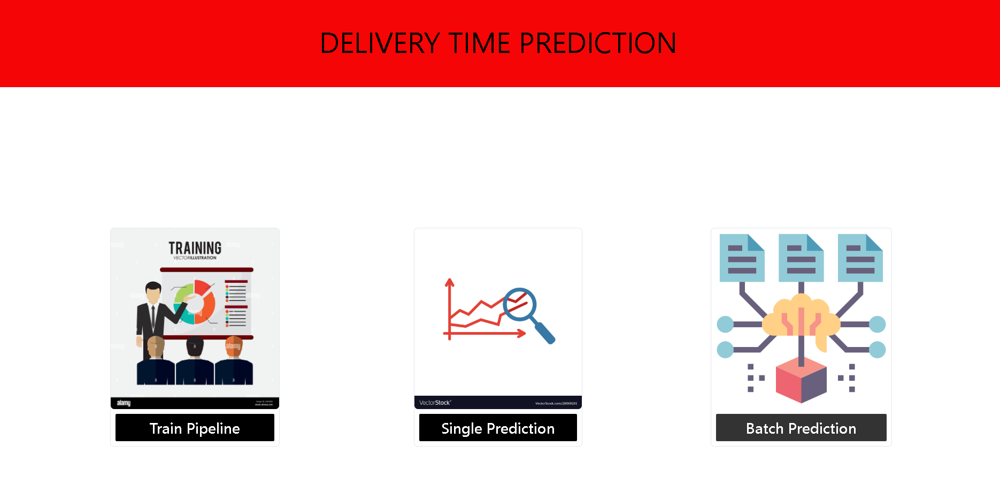
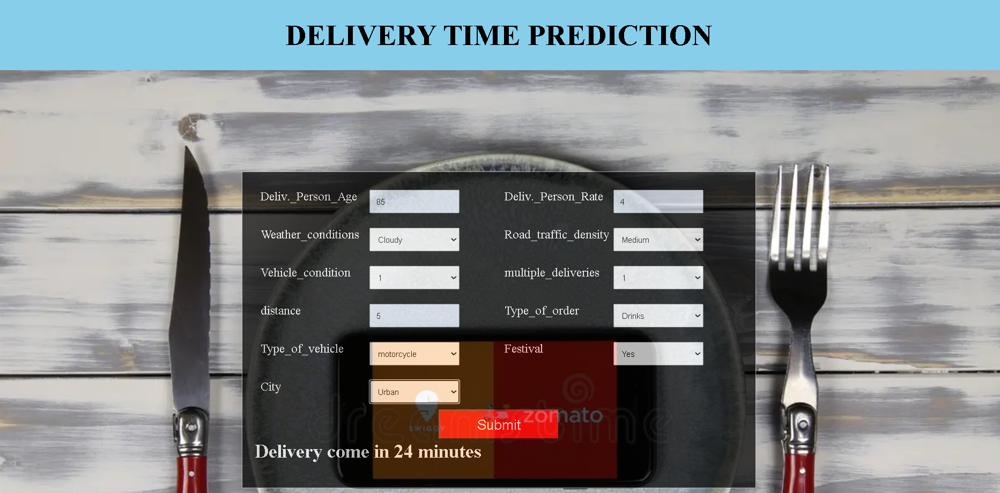

# Delivery Time Predictor





## Problem Statement

Food delivery services like **Zomato** and **Swiggy** rely on accurate delivery time predictions to maintain transparency with customers. Machine Learning models can help estimate the delivery time based on historical data, considering factors such as distance, traffic conditions, and weather.

This project aims to build a **Delivery Time Predictor** that estimates the time required for food to reach the customer based on various factors.

---

## Features

- **Real-time Prediction**: Users can input order details to get an estimated delivery time.
- **Batch Prediction**: Upload a CSV file for bulk predictions.
- **Model Training**: Train a new model using historical data.
- **Logging and Exception Handling**: Detailed logs for debugging and monitoring.

---

## Project Structure

```
Delivery_Time_Predictor/
│── Batch_Prediction/               # Batch prediction functionality
│── Delivery_Time_Predictor/
│   ├── config/                      # Configuration files
│   ├── constants.py                  # Constant variables
│   ├── exception.py                   # Custom exception handling
│   ├── logger.py                      # Logging module
│   ├── pipeline/
│   │   ├── prediction_pipeline.py    # Single prediction pipeline
│   │   ├── training_pipeline.py      # Model training pipeline
│   ├── utils.py                      # Utility functions
│── templates/                        # HTML templates for Flask
│── static/                           # Static assets (CSS, JS)
│── app.py                            # Flask app entry point
│── requirements.txt                   # Dependencies
│── README.md                         # Project documentation
```

---

## Installation

### 1. Clone the Repository
```bash
git clone https://github.com/PriyanshuDey23/Delivery-Time-Predictor.git
cd Delivery-Time-Predictor
```

### 2. Create and Activate a Virtual Environment
```bash
python -m venv venv
source venv/bin/activate  # On Mac/Linux
venv\Scripts\activate     # On Windows
```

### 3. Install Dependencies
```bash
pip install -r requirements.txt
```

---

## Usage

### Start the Flask App
```bash
python app.py
```
The app will be available at: **http://127.0.0.1:8888/**

### Predict Delivery Time (Single Input)
1. Go to the **Home Page**
2. Click on **Predict Delivery Time**
3. Enter the required details in the form
4. Click **Predict** to get an estimated delivery time

### Perform Batch Prediction
1. Go to **Batch Prediction** page
2. Upload a CSV file with delivery details
3. Click **Submit** to get batch predictions

### Train a New Model
1. Go to **Train Model** page
2. Click **Start Training** to train a new model

---

## Technologies Used

- **Python**
- **Flask** (Web Framework)
- **scikit-learn** (Machine Learning Models)
- **pandas & NumPy** (Data Handling)
- **Pickle** (Model Serialization)
- **Logging & Exception Handling**

---

## License
This project is open-source and available under the MIT License.